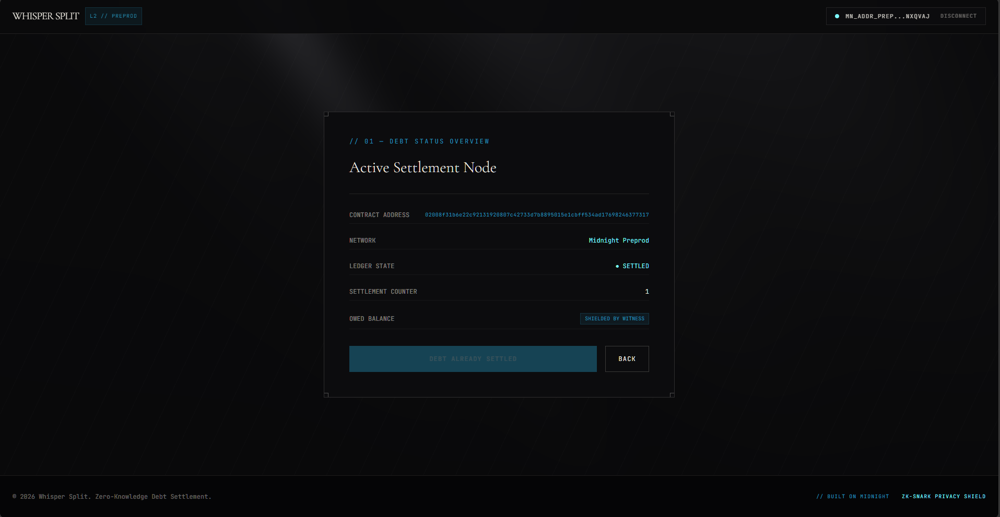

# Whisper Split


> A privacy-preserving expense settlement and payroll dApp on the Midnight Network. Built cumulatively across the Midnight Builder Challenge: Level 1 (private debt settlement circuit), Level 2 (Lace wallet on Preprod wired to the frontend), and Level 3 (private payroll split with Merkle-based claims) — all in one codebase.

## Live Demo

[https://whisper-split.vercel.app/](https://whisper-split.vercel.app/)

## Contract Address

| Network | Contract | Address |
| --- | --- | --- |
| Preprod | Level 1/2 debt (`debt.compact`) | `7be56003e58b9f442707b87ba31482638e0629aded447676a401507cbd8c9848` |
| Preprod | Level 3 split (`split.compact`) | `8242eb8ae69b78e2aadc86ff074eb0bf8f19bdb8425f7fd4c6ef6c0a7b2bff9d` |

Level 1/2 debt deployment evidence — deploy and a real `settleDebt()` call, both independently confirmed on the Preprod explorer:

- Deploy tx: [`47503aef6dfb5af7b3b8b0e0cdf045f0f5b7596783c63d289b5ff811a3cbbbe3`](https://preprod.midnightexplorer.com/transactions/47503aef6dfb5af7b3b8b0e0cdf045f0f5b7596783c63d289b5ff811a3cbbbe3)
- Settlement circuit call tx: [`f98789ac4403c13ac82bdc1fefb338c2ac1f6eec1a751f415f3ae3a047f5f45a`](https://preprod.midnightexplorer.com/transactions/f98789ac4403c13ac82bdc1fefb338c2ac1f6eec1a751f415f3ae3a047f5f45a)

Level 3 split deployment evidence — a full, independently verified deposit → two private claims round trip moving real unshielded NIGHT (80 base units deposited, fully distributed to two distinct participants, pool custody down to 0):

- Deploy tx: [`3550d3cd774ae9664ea4ced91062a0d5bcbd137b75f0acd8a8c0a9f84cb79d5b`](https://preprod.midnightexplorer.com/transactions/3550d3cd774ae9664ea4ced91062a0d5bcbd137b75f0acd8a8c0a9f84cb79d5b)
- Deposit tx (80 base units of real NIGHT escrowed into contract custody): [`923a06e80bc372bc3b6161e11c923a306a100e8003cb4f6c7cb6e442e1f77683`](https://preprod.midnightexplorer.com/transactions/923a06e80bc372bc3b6161e11c923a306a100e8003cb4f6c7cb6e442e1f77683)
- Claim tx, participant 1 (50 base units paid to their own address): [`b5f235529376e69cc009848cabeaf960e0115f63add8b31913c44fcd25e1f6df`](https://preprod.midnightexplorer.com/transactions/b5f235529376e69cc009848cabeaf960e0115f63add8b31913c44fcd25e1f6df)
- Claim tx, participant 2 (30 base units paid to their own address): [`0b9a8c3ea6772b0dbdebbdc6888bde9869f4df672aa661ce38565d004172af52`](https://preprod.midnightexplorer.com/transactions/0b9a8c3ea6772b0dbdebbdc6888bde9869f4df672aa661ce38565d004172af52)

Both participants claimed independently, each only ever proving and revealing their own share — the two claim transactions never disclose anything about the other participant's amount.

## What This Does

One dApp, three levels built on the same project:

1. **Level 1 — Private debt settlement** (`contracts/debt.compact`): a debtor proves `paidAmount == owedAmount` in zero knowledge. Only `settled` and `settlementCount` are public; the amounts never touch the ledger. Mismatches and repeat settlements are rejected.
2. **Level 2 — Lace on Preprod**: the React/Vite frontend connects/disconnects the Lace wallet via the DApp Connector API (v4), deploys the debt contract, calls `settleDebt` from the browser, and reads back the indexed public state.
3. **Level 3 — Private payroll split** (`contracts/split.compact`): an organizer deposits real NIGHT and commits to participant shares via a Merkle root. Each recipient claims their own share independently (pull, not bulk push) by proving Merkle membership plus their exact entitlement — share, salt, and proof stay private witnesses; only the claiming participant's own payout amount becomes visible, at the moment they claim.

Level 1/2 debt flow lives in `src/components/CircuitCall.tsx` and `src/debtProviders.ts`; the Level 3 payroll console lives in `src/pages/SettlementFlow.tsx` and `src/midnightProviders.ts`. Both share one wallet connection (`src/hooks/useMidnight.ts`).

## Privacy Model

### Debt (Level 1/2)

- **PUBLIC:** `settled`, `settlementCount`, transaction metadata.
- **PRIVATE (witness, never on-chain):** the owed amount (`getOwedAmount()` witness) and the paid amount circuit argument.
- **PROVED without revealing:** `paidAmount == owedAmount`, gated through a deliberate `disclose(isPaid)`.

Limit: both amounts are prover-controlled — this proves arithmetic equality, not an authentic external debt or token transfer.

### Payroll split (Level 3)

This is real fund custody, not accounting: `deposit()` escrows real NIGHT into
the contract (`receiveUnshielded`) and `claim()` pays a participant's exact
share back out (`sendUnshielded`). NIGHT has no shielded form at all — per
Midnight's own docs, "there is no mechanism to move a token between shielded
and unshielded state" — so genuine NIGHT custody is unavoidably unshielded,
and that shapes what's actually private here:

- **PUBLIC:** `sharesRoot` (Merkle root over the allocation list),
  `depositAmount` (remaining pooled balance), `distributionCount`, the
  `claimed` map of participant IDs, and — the moment a specific participant
  calls `claim()` — *that participant's own* payout amount, since a real
  NIGHT transfer's amount is inherently visible on-chain.
- **PRIVATE (witness, never on-chain):** every other participant's share,
  secret salt, and Merkle path. Nothing about the full allocation breakdown
  is derivable from the deposit transaction alone.
- **PROVED without revealing:** membership in the committed allocation list,
  and that a claim pays out exactly the entitled amount — verified entirely
  against private witnesses, so the Merkle root by itself reveals nothing
  about who gets how much.
- **Identity binding:** `claim()` asserts the caller's own unshielded address
  matches the claimed participant ID, so a claim can only ever pay out to
  the wallet that's actually entitled to it — participant IDs are
  wallet-bound, not pseudonymous handles.

Limit: privacy here is *per-claim*, not *forever-hidden*. Once you claim,
your own amount is on the public record for anyone watching that
transaction; what stays hidden is everyone else's, for as long as they
haven't claimed yet.

## Privacy Claim

An on-chain observer sees: that a deposit and later claims occurred, the
pool's total and remaining balance, which participant IDs have claimed, and
— for each participant who has claimed — the exact amount they received.
An observer cannot see: the shares of participants who haven't claimed yet,
any participant's secret salt, or their Merkle path. The debt contract's
owed/paid amounts likewise never appear as stored ledger fields. Any
configured remote proof server could observe private proving inputs —
browser-local proving should be verified with your wallet's actual proving
path.

## Tech Stack

- **Midnight Network** — zero-knowledge smart contract platform (Preprod)
- **Compact** — smart contract language (compiler 0.31.1, language version 0.23.0, runtime 0.16.0)
- **Midnight.js SDK** — `@midnight-ntwrk/*` packages v4.1.1
- **React 19 + Vite 5 + TypeScript + Tailwind CSS** — frontend
- **Lace wallet** — browser wallet via DApp Connector API v4
- **Vitest** — circuit and state test suite (11 tests)
- **GitHub Actions** — CI/CD
- **Docker** — optional local proof server (`midnightnetwork/proof-server` on port 6300)

## Prerequisites

- Node.js v22+
- The Compact CLI installed and available; run `npm run compact:setup` to install the pinned compiler before compiling. Windows also requires WSL.
- Lace wallet browser extension, configured for Preprod, with Preprod funds/DUST
- Docker (only if running the local proof server)

## Setup & Run Locally

```sh
git clone https://github.com/MayankShastri/whisper-split.git
cd whisper-split
npm install
npm run compile   # compiles both debt.compact and split.compact into managed/
npm test
npm run typecheck
npm run dev       # → http://localhost:5173
```

Then in the app: select Lace/Preprod, connect, and use the **Debt settlement** screen (Level 1/2 flow) or the **Payroll console** (Level 3 flow).

## Run Tests

```sh
npm test
```

Covers both contracts — circuit logic, state transitions, rejection paths (double settlement, double claim, insufficient funds), and privacy assertions (private witnesses never appear in ledger state). Current verified snapshot:

| Command | Result |
| --- | --- |
| `npm run compile` | Both circuits compiled (0.31.1) |
| `npm test` | 11/11 passing (5 debt + 6 split) |
| `npm run typecheck` | Clean (`skipLibCheck` for upstream `compact-js` declaration issues) |
| `npm run build` | Zero-error production build |

## CI/CD

On every push to `master` and every pull request, GitHub Actions checks out the code, sets up Node 22, installs dependencies, compiles both contracts, and runs the test suite. See `.github/workflows/ci.yml`. Verified green on a real push — badge above.

## Product Proposal

See [PROPOSAL.md](PROPOSAL.md).

## Demo Video

One combined video covers both levels — wallet connect, debt settlement (deploy → prove equality and settle → on-chain result), and the payroll console (deploy → deposit → two independent private claims → tests/CI).

[PLACEHOLDER — YouTube link]

## Initial Idea

Shared expenses are personal: who owes what shouldn't be broadcast to the group, let alone written permanently to a public chain. Whisper Split started (Level 1) as a zero-knowledge debt settlement — prove the debt is settled, nothing more. Level 2 gave it a face: a Lace-connected frontend on Preprod. Level 3 extended the same app into private payroll: commit to a distribution list off-chain and let recipients claim privately via Merkle membership proofs.

## Screenshots

### 1. Compact Compiler Output (Level 1)


### 2. Vitest Test Suite (Level 1, 5/5 Passing)


### 3. Settlement Dashboard & Contract Address (Level 1)


TODO: Add current cumulative-build screenshots (compile, tests, Lace connection, indexed results) — without exposing private inputs or participant vouchers.

## Submission Checklist

### Level 2

- [x] Lace connect / disconnect implemented (DApp Connector API v4, Preprod)
- [x] Circuit called successfully from the frontend (`settleDebt`)
- [x] Observable privacy behavior (equality proved, amounts not rendered or published)
- [x] Contract deployed to Preprod with verifiable address (fresh deploy + settle, both confirmed on explorer — see Contract Address section)
- [x] Minimum 8 meaningful commits (14 since the Level 1 tip)
- [x] Live demo link
- [ ] Demo video link

### Level 3

- [x] 3+ tests passing (11/11)
- [x] CI/CD pipeline configured on push/PR
- [x] CI badge in README (verified green run)
- [x] Contract address in README (deploy/deposit/claim all verified on explorer — see Contract Address section)
- [x] Privacy Model section
- [x] PROPOSAL.md
- [x] dApp builds with zero errors
- [x] Live demo link
- [ ] Demo video link
